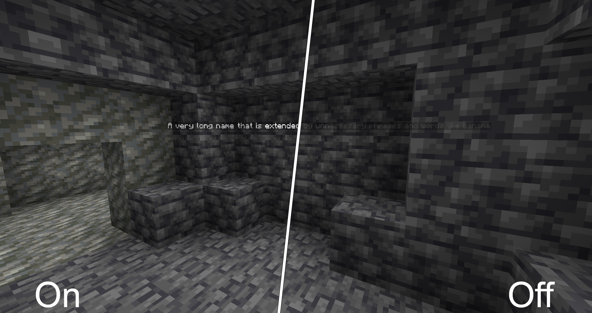
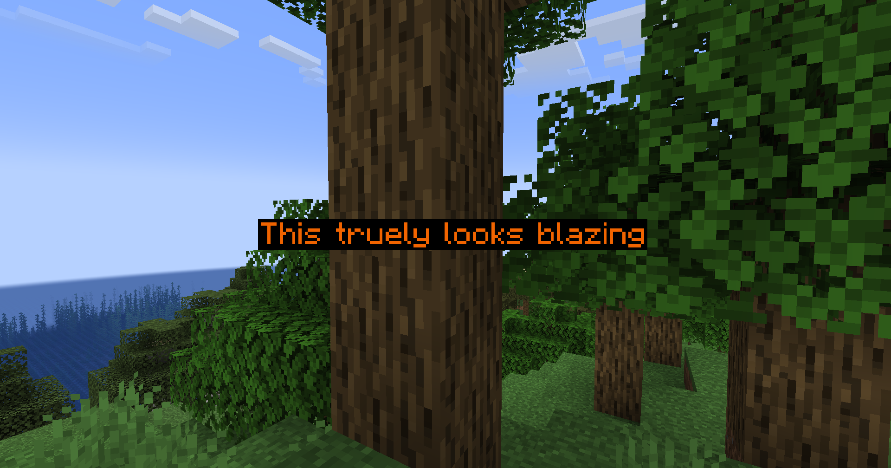
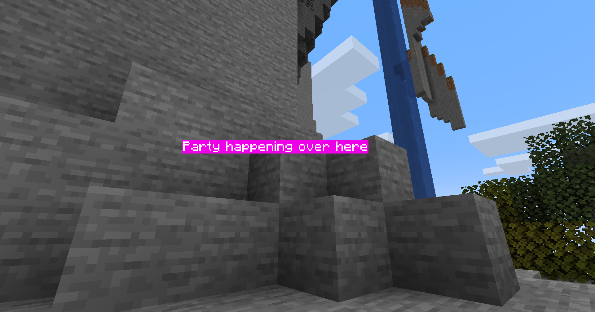
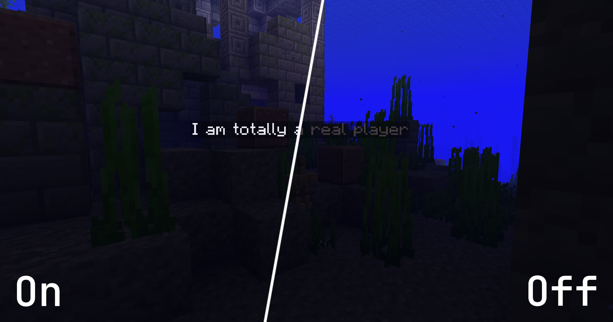
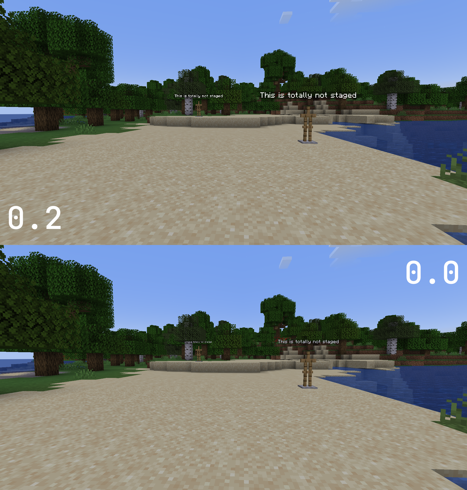

<a href="https://codeberg.org/Hoetty/marble">
    
</a>

# Better Name Visibility

[![Modrinth](https://img.shields.io/badge/dynamic/json?labelColor=black&color=grey&label=&suffix=%20downloads&query=downloads&url=https://api.modrinth.com/v2/project/better-name-visibility&style=flat&logo=data:image/png;base64,iVBORw0KGgoAAAANSUhEUgAAACAAAAAgCAMAAABEpIrGAAAAIGNIUk0AAHomAACAhAAA+gAAAIDoAAB1MAAA6mAAADqYAAAXcJy6UTwAAAJPUExURQAAABvZahWnUha1WAYzGQlHIxvZahvZahvZahvZahvZahvZahvZahvZahvZahvZahvZahvZahvZahvZahvZahvZahvZahvZahvZahvZahvZahvZahvZahvZahvZahvZahvZahvZahvZahvZahvZahvZahvZahvZahvZahvZahvZahvZahvZahvZahvZahvZahvZahvZahvZahvZahvZahvZahvZahvZahvZahvZahvZahvZahvZahvZahvZahvZahvZahvZahvZahvZahvZahvZahvZahvZahvZahvZahvZahvZahvZahvZahvZahvZahvZahvZahvZahvZahvZahvZahvZahvZahvZahvZahvZahvZahvZahvZahvZahvZahvZahvZahvZahvZahvZahvZahvZahvZahvZahvZahvZahvZahvZahvZahvZahvZahvZahvZahvZahvZahvZahvZahvZahvZahvZahvZahvZahvZahvZahvZahvZahvZahvZahvZahvZahvZahvZahvZahvZahvZahvZahvZahvZahvZahvZahvZahvZahvZahvZahvZahvZahvZahvZahvZahvZahvZahvZahvZahvZahvZahvZahvZahvZahvZahvZahvZahvZahvZahvZahvZahvZahvZahvZahvZahvZahvZahvZahvZahvZahvZahvZahvZahvZahvZahvZahvZahvZahvZahvZahvZahvZahvZahvZahvZahvZahvZahvZahvZahvZahvZav///9ScwmYAAADDdFJOUwAAAAAAAA8zW3uOYwIBK3rB6Pn+ml18KiGL5HEDquOIH07R/UzKz2zu+uLHIibtafWkVCMNBRqg7/RQuT8EQbvT+5ETDBSU/NAgCSdZlcQKii7mtxJY5fF/7D1SRkB+EcWh4UilOOtPMdTCR1PqN969vmGDCw7G4DSSsAcGHrSPr3bds5CEwDKoXumcZdwcG4KmjayX32A79pjOqRjIFoXynVYVgPi6qxDnL78p2obVJFquNbGZCPdyvHPZ1yhuh8s+iRzcsrEAAAABYktHRMQUDBvhAAAAB3RJTUUH5wQXDwgZWDUtiQAAAqRJREFUOMttU/k7lFEU/k4L4hsxtNAnhRgiJZOiSfbI2oJpmRFCi2kV0aaNVLTIEpVISmnf97r/WO+534yZnqfzw73vOe+559xz7rmKIoVYvLx95vj6qUSqVBW3sGrwnxsQaAwSwcDz5i9g0wxPfmFIqJCyiEgLE4vDl7iD8PGlETotIqOQahlAdJTLA5sWY5JsbNzysHiihEBWViRqRDOlgyFmJVtMq5JWJ5vhvyZlLevrEmUILKl8PihtvYWcYt6QLmNwFjjEb4SSkZnlZLO5yJzcPBg35bODwZfPZxYwWbC5sKjYzwBUkssxSg1wKNsCtHUb89vTy3GwopBxDmcJ9YdDJYB1B9t2WmUtcbtkqt18Mxsp9irsezS2VEu+uka/mqUWSrFd2VsnhLEetoZ9TFv3HwCexdUdjBWi0aH4YTuEvtoPM3/EO1nnuTpEjD2qHIM54DhR0wmA5hZySzIntyknsbZyi8IB0tp07tRpBDKfgeWsdDjHDlFGRIjnl3O0t573gcMFUBeVS1gvlxB1dOZxv0pIu9IF01UDZRdjr1SuZQhxvbvnRrmsMePmrdsrGPRaKP8OLtmn9KM7A4N3xb8yNExUb5RlZt2btpZbXajzPoYkBaDKrtADp3HkYdloo56ndgx37UcHxSP0tIWBGH9cg1nx6TJFTNhS7eCfcA1PJ+GgDbLDs2GuX3V05Ohj0xYSBGumyq/yfApw4EWTRxPJqxQvIF6+ks9Gr0d4nN+8Nbhoi+NdJEwVSc6hVNvHOUvg+5qeDxoP3GQz6x8/qXLuZ6Op7SPy+gNTnydSELabk1Z8Mbs/hlr4dbobfUgxJMS3UdXza9H33jqnA3/OH41FCZ7/l7HW8vOXiWc9GvPf06D953/T2O/EP8HBNtcH0Zm/lqFNUgTAex4AAAAldEVYdGRhdGU6Y3JlYXRlADIwMjMtMDQtMjNUMTU6MDg6MjQrMDA6MDAE5dOaAAAAJXRFWHRkYXRlOm1vZGlmeQAyMDIzLTA0LTIzVDE1OjA4OjI0KzAwOjAwdbhrJgAAACh0RVh0ZGF0ZTp0aW1lc3RhbXAAMjAyMy0wNC0yM1QxNTowODoyNSswMDowMITaQU0AAAAASUVORK5CYII=)](https://modrinth.com/mod/better-name-visibility)
[](https://www.curseforge.com/minecraft/mc-mods/better-name-visibility)

This mod improves the visibility of all vanilla names rendered.
The improved rendering can be turned off or on at any time using a configurable key (Standard: ```+```).



## Configuration

Several configuration options are provided through [YACL](https://modrinth.com/mod/yacl) starting with v2.0.2. You can edit the config using [Mod Menu](https://modrinth.com/mod/modmenu). If you are looking for a no-config version with less dependencies version v1.1 may be for you.

### Foreground Color

Controls the text color and opacity of names. *It defaults to fully opaque white.*


### Background Color

Controls the background color of name tags. *It defaults to semi transparent black.*


### Fullbright Names

Name tags are no longer affected by the current light level. This only affects names that are not rendered behind other blocks. Names behind other blocks are always fullbright. *It defaults to on.*


### Distant Name Scaling

Sets the scaling of distant names from ```0.0``` to ```1.0```. At ```0.0``` names are not scaled at all. At ```1.0``` all names appear the same size, regardless of distance. *It defaults to ```0.2```.*


### Render Names At Any Distance

By default Minecraft stops rendering names farther away than 64 blocks. This limit can be disabled, but is only recommended with decent name scaling enabled. *It is disabled by default.*

### Disable Team Colors

Team Colors will by default overwrite the ```RGB``` components of your custom foreground colors. You may enable this option to force the use of your configured text color. *It is not enabled by default.*

## Shader Support

Correct functionality in combination with shaders is not guaranteed. Some shaderpacks may support all functionality, while other shaderpacks will only work partly, i. e. not renderering names through walls.
